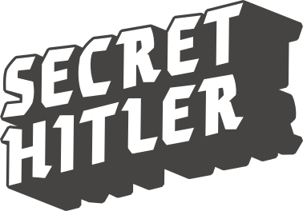

# Secret Hitler

***CAN YOU FIND AND STOP THE...***



> *The year is 1932. The place is pre-WWII Germany. In Secret Hitler, players are German politicians attempting to hold a fragile Liberal government together and stem the rising tide of Fascism. Watch out though—there are secret Fascists among you, and one player is Secret Hitler.*

This is a Python implementation of the board game [Secret Hitler](https://www.secrethitler.com), the game rules for which are available [here](https://www.secrethitler.com/assets/Secret_Hitler_Rules.pdf).

In this implementation, players can either play amongst themselves, play with different LLMs, or simply watch the LLMs play with each other.

## 🎲 Table of Contents

- [🧑‍💻 Installation](#-installation)
- [💻 Usage](#-usage)
- [📝 Notes](#-notes)

## 🧑‍💻 Installation

1. Clone the repository:

    ```
    git clone https://github.com/kwonathan/secret-hitler.git
    ```

2. Navigate to the project directory:

    ```
    cd secret-hitler
    ```

3. Make sure that the OpenAI Python SDK is installed, and that you have created and exported an API key by following the instructions [here](https://platform.openai.com/docs/quickstart).

## 💻 Usage

To start the game, run the following command:

```
python main.py
```

The following options are available:

- `-P` or `--players` (default: `5`): specify the number of human and/or LLM players (options: `5` to `10`).
- `-H` or `--humans` (default: `0`): specify the number of human players (options: `0` to `10`).
- `-S` or `--strategy` (default: `False`): specify whether the LLMs should use an optional strategy prompt (options: `True` or `False`).
- `-M` or `--model` (default: `gpt-4o-mini`): specify the [model](https://platform.openai.com/docs/models) to use for the LLMs (`gpt-4o` or `gpt-4o-mini`).

> [!TIP]
> The LLMs can have a tendency to hallucinate conversations between the players. If this happens consistently, or you find that they are not following some of the game rules (for example, on re-election eligibility), consider switching to the `gpt-4o` model, which is more powerful but still relatively inexpensive to run.

## 📝 Notes

This work was done as part of the *Cooperative AI: Foundations & Frontiers* module for the [AIMS CDT](https://aims.robots.ox.ac.uk). I hope you have fun watching the LLMs play against each other and playing with them!
